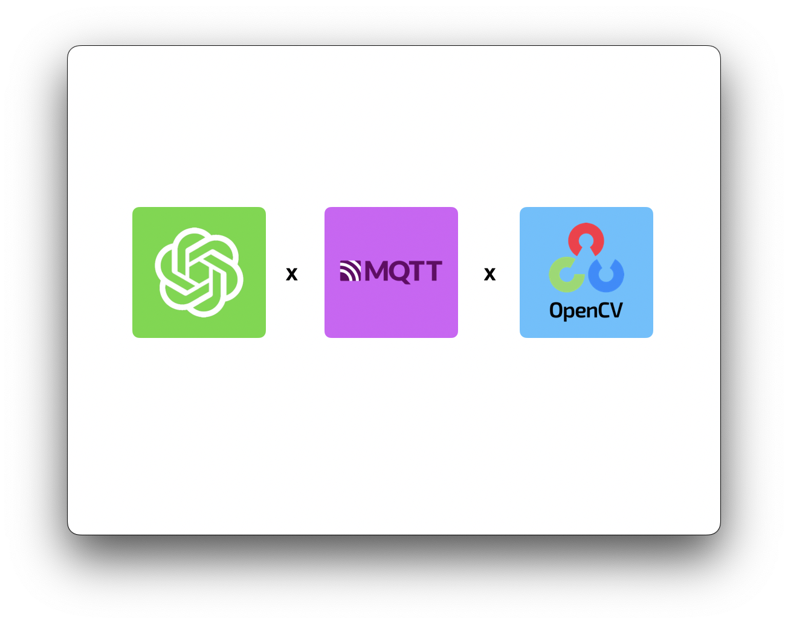

# Chatberry Pi
### ChatGPT meets MQTT and OpenCV..

## What is Chatberry Pi?
Chatberry Pi is a chatbot built on OpenAI's GPT 3.5 Turbo. It links back to a Raspberry Pi (via MQTT) and can detect if a viewer is visible in the camera feed (via OpenCV). 

## Getting Started
All information needed is available in the [Chatberry Pi Setup Guide](https://github.com/robert-walshh/Chatberry-Pi/blob/main/iterations/iteration3/setup_it3.md)

## Video Demo
A video demonstration is available [here](https://youtu.be/4cfEKkKF0II?si=K8FrqnsJRqWVQ4Yd)

